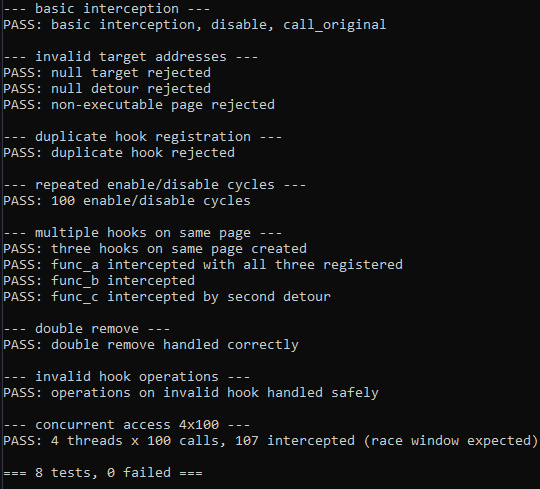

# vehhook - VEH + PAGE_GUARD Function Interception

vehhook is a single-header C++20 Windows function interception framework that redirects execution entirely through **Vectored Exception Handling** and **PAGE_GUARD** memory protection.

Unlike MinHook, Detours, and most traditional hooking libraries, vehhook does not modify target code, patch instructions, or allocate trampolines. No code bytes are ever overwritten. No executable memory is ever allocated.

| Feature | vehhook | MinHook / Detours |
|---|---|---|
| Modifies target code | No | Yes |
| Trampolines | No | Yes |
| Instruction relocation | No | Yes |
| Executable memory allocation | No | Yes |
| Uses VEH | Yes | No |
| Uses PAGE_GUARD | Yes | No |

## how it works

1. `PAGE_GUARD` is set on the memory page containing the target function
2. When the target is called, the CPU raises `STATUS_GUARD_PAGE_VIOLATION`
3. The Vectored Exception Handler catches it and replaces the instruction pointer with the detour address
4. The Trap Flag is set, causing `STATUS_SINGLE_STEP` after one instruction
5. The single-step handler re-applies `PAGE_GUARD` and execution continues

you end up with function interception without ever touching the original code.

## why does this exist?

most hooking libraries work by overwriting the first few bytes of the target function. that's fine for production, but i wanted to understand the exception handling internals of Windows better.

this project is purely educational. it's meant to demonstrate:

- how `PAGE_GUARD` memory protection works
- how Vectored Exception Handling works
- how `STATUS_GUARD_PAGE_VIOLATION` and `STATUS_SINGLE_STEP` interact
- how thread context manipulation works at the exception handler level
- that you can intercept functions without ever touching the original code

## the flow

```
User calls create(target, detour)
            |
            v
      Find target page via VirtualQuery
            |
            v
      Store original page protection
            |
            v
      Apply PAGE_GUARD via VirtualProtect
            |
            v
      Register hook entry
```

at runtime:

```
Target function is called
            |
            v
      CPU hits PAGE_GUARD page
            |
            v
      STATUS_GUARD_PAGE_VIOLATION
            |
            v
      VEH handler fires
            |
            v
      Match RIP to hook target
            |
            v
      Replace RIP with detour
            |
            v
      Set Trap Flag (EFlags |= 0x100)
            |
            v
      Continue execution (retry instruction)
            |
            v
      Detour executes
            |
            v
      STATUS_SINGLE_STEP fires
            |
            v
      Re-apply PAGE_GUARD
            |
            v
      Continue execution
```

## implementation

- ~430 lines of C++20
- Single-header library (drop `src/vehhook.h` into your project)
- 100% usermode
- No external dependencies
- Automated test suite (8 test cases)

## prerequisites

- Windows x64
- MSVC (Visual Studio 2022)
- CMake 3.20+

## building

```cmd
cmake -B build/intermediate -S .
cmake --build build/intermediate --config Debug
```

the test executable ends up in `build\vehhook_test.exe`.

## project structure

```
vehhook/
├── CMakeLists.txt           # root build config
├── src/
│   └── vehhook.h            # the entire library (single header)
├── test/
│   ├── CMakeLists.txt
│   └── test.cc              # automated tests
├── build/
│   ├── vehhook_test.exe     # compiled test binary
│   └── intermediate/        # cmake build artifacts
└── images/
    └── 9FDC8A61-C591-412D-B6A1-E13D35DE64D6.png
```

## basic usage

```cpp
#include "vehhook.h"

static int WINAPI DetourFunc() {
  return 0;
}

void example() {
  auto hook = vehhook::create(TargetFunction, DetourFunc);
  if (!hook.IsValid()) {
    return;
  }

  hook.Enable();

  TargetFunction();

  auto result = vehhook::call_original<int>(hook);

  hook.Disable();
  remove(hook);
}
```

## call_original

since there's no trampoline, `call_original` works by temporarily disabling the hook, calling the original function, then re-enabling it. the RAII scope guard makes sure it gets re-enabled even on early return.

```cpp
static int WINAPI MyDetour(int x) {
  printf("detour: %d\n", x);
  return vehhook::call_original<int>(g_hook, x);
}
```

## multiple hooks per page

if you have three functions on the same page, you can hook all of them. the library tracks each hook individually and only re-arms the page guard when at least one hook on that page is enabled.

## robustness

the test suite covers malformed and edge-case scenarios:

- **invalid target addresses** - null pointers and non-executable pages are rejected at hook creation time
- **duplicate hooks** - registering the same target twice returns an invalid hook
- **repeated enable/disable** - 100 consecutive enable/disable cycles without state corruption
- **multiple hooks on same page** - three functions on one page, each independently hooked with different detours
- **double remove** - calling `remove()` on an already-removed hook is safe (returns false)
- **invalid operations** - `Enable`, `Disable`, `IsEnabled`, and `remove` on an invalid hook all return false safely
- **concurrent access** - 4 threads each calling the hooked function 100 times; the guard page race window is visible (not all calls are intercepted) but no crashes or corruption occur

## limitations

- **PAGE_GUARD applies to the whole page** - if the target page contains other functions that get called, they'll trigger guard violations too. the handler handles this gracefully (just continues execution), but it means those calls consume the guard and your hook won't fire until the next cycle
- **no trampolines** - use `call_original` instead, which temporarily disables the hook
- **same-page targets** - if your target function is on the same page as your hook management code, setting `PAGE_GUARD` will trigger on your own code. this is expected - just target functions in other DLLs or modules
- **no cross-process support** - VEH is per-process
- **race conditions** - between disabling a hook and calling the original, another thread might sneak in. this is inherent in the approach

## what i learned

- `PAGE_GUARD` is consumed on first access and clears itself. you have to re-apply it every time
- `STATUS_GUARD_PAGE_VIOLATION` fires before the instruction executes, so you can redirect RIP
- the Trap Flag (0x100 in EFlags) causes `STATUS_SINGLE_STEP` after exactly one instruction
- the CPU clears the Trap Flag before delivering the single-step exception, so it only fires once per set
- `VirtualProtect` in an exception handler for the same page that just faulted creates an infinite loop (don't do that)
- SRW lock functions in kernel32 might share a page with your target, consuming the guard before your hook fires

## test output


